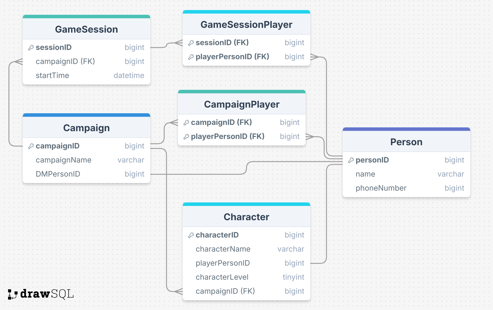

# Dungeons and Dragons

My project models data that would be used in an app to keep track of D&D campaigns/sessions. This includes name and contact info (phone #) for both players and DMs (also allows for players to be DMs as well,) who is playing/dming for each campaign/session, and some basic information for characters that the players have.





## Question I thought it did well on


**Question**: "Who plays a level 1 character?" (Question 8)

**GPT SQL Response**:
```sql
SELECT p.personName
FROM Person p
JOIN Character c ON p.personID = c.playerPersonID
WHERE c.characterLevel = 1;
```

**Friendly Response**: The level 1 characters are played by Wren, Cigg, Ro, and Josh.

**My Comments**: This one worked great! This was one of the ones where both the zero shot and cross domain double shot output the same results.


## Question that it tripped up on


**Question**: "What campaign has no players in it?" (Question 4)

**GPT SQL Response**:
```sql
SELECT campaignID, campaignName 
FROM Campaign 
WHERE campaignID 
NOT IN (SELECT campaignID FROM CampaignPlayer);
```

**SQL Result**: [(3, 'No one')]

**Friendly response**: The campaign you are referring to has no players in it.

**My Comments**: This one was SUPER interesting!!! I kind of did it on accident, by naming an empty campaign "No one." (Because it was empty.) The SQL response was *correct*, but was misunderstood by the AI and it gave the wrong response. 

This response was with the zero shot strategy, but the interesting part is that the cross domain double shot got the same correct SQL response, but got the *right* friendly response: 'The campaign with no players in it is number 3, named "No one."'
(It did mention the number 3 though, which was not neccessarily needed/wanted, but it didn't mention the number on future questions involving that particular campaign (Ex: Question 12))


## Strategies
I used both the zero shot and the cross domain double shot strategy. (I actually did this on accident, because I forgot to change the single domain double shot from Professor Reynolds' code template.) I ran all of my questions through both strategies, and have all the questions and responses recorded in otherResponses.txt.

I stated a few differences and similarities above, but I'll note some more of my findings between them here. For any questions regarding the campaign named "No one", the cross domain double shot strategy easily outperformed the zero shot strategy. It is really interesting, and I want to learn more about why the somewhat simple seeding of an example from a completely different database allowed the AI to understand that "No one" was a name instead of the actual answer to the question. At the end, I do think that the cross domain double shot strategy was more effective than the zero shot strategy.


## Conclusion
I found that chatgpt 4 does very well at creating SQL queries. All of the questions I asked had the correct SQL response. The main downside I've seen is in the interpretation of the results, as both strategies I used sometimes mentioned the "data provided" or even including the SQL response itself. This is likely due to the way I formatted the way it asks the questions, and could likely be fixed. Another error I found because of of my accidental naming of a campaign as "No one", is that the zero shot strategy got the interpretation wrong several times when given questions that included this result.

To conclude, I was very surprised at how effective the AI was in both creating the SQL queries and interpreting the results, even though it got a few interpretations wrong. I think there is incredible application to basically all applications, and with the right settings/improvements/edge-case-handling could be very effective for all users.
